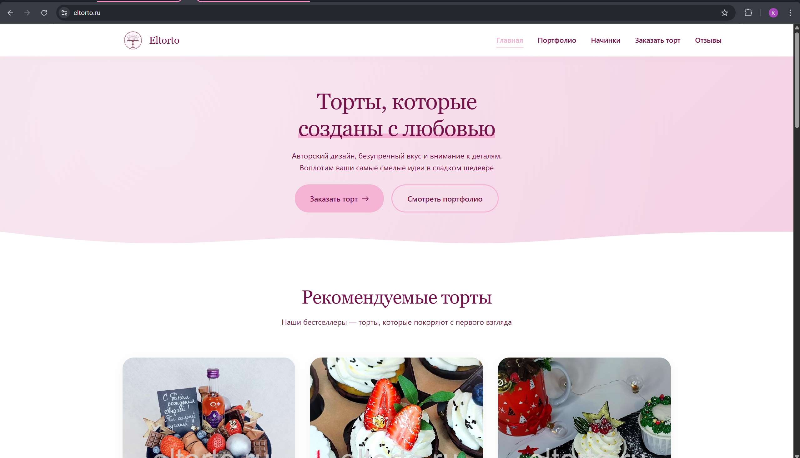
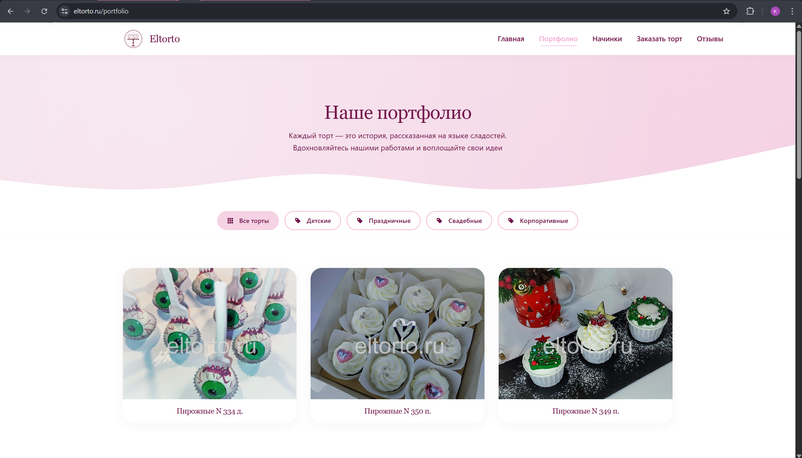
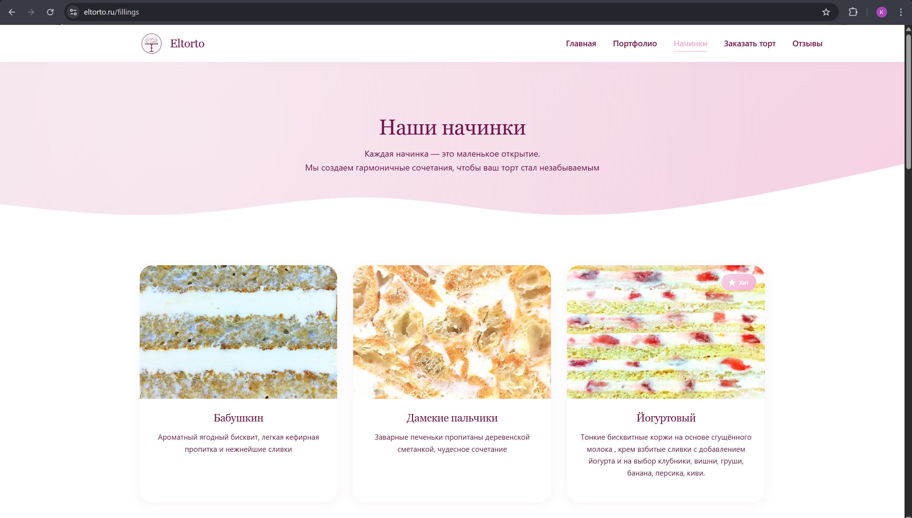
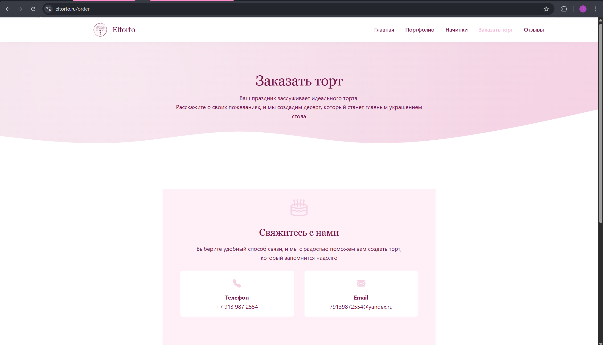
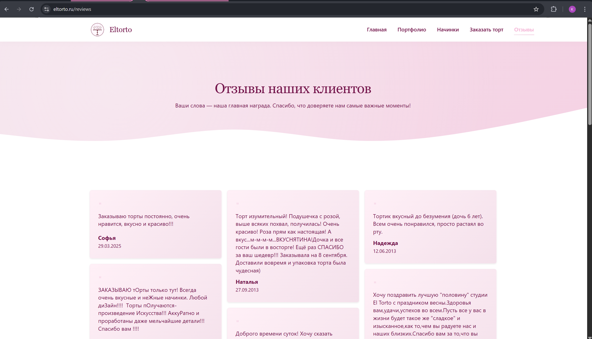

# 🍰 Eltorto

Современный сайт-визитка для кондитерской с каталогом тортов, начинок, формой заказа и отзывами.  

🌐 **Рабочий сайт**: [https://eltorto.ru](https://eltorto.ru)

---

## 📸 Галерея

| |
|-|
| **🏠 Главная страница** |
|  |
| **🍰 Каталог тортов** |
|  |

<details>
<summary><b>📸 Посмотреть больше скриншотов (кликните, чтобы развернуть)</b></summary>

| |
|-|
| **🎂 Страница начинок** |
|  |
| **📦 Оформление заказа** |
|  |
| **📝 Отзывы** |
|  |

</details>

---

## 🛠️ Технологический стек

| Слой          | Технологии                                   |
| ------------- | -------------------------------------------- |
| **Backend**   | C# / .NET 8, ASP.NET Core, Entity Framework Core |
| **Frontend**  | Angular, TypeScript, SCSS                  |
| **База данных** | PostgreSQL                                   |
| **Инфраструктура** | Docker, Docker Compose, Nginx, GitHub Actions |
| **Безопасность** | Let's Encrypt SSL, автообновление сертификатов |
| **Тестирование** | Python (интеграционные тесты инфраструктуры) |

---

## 🏗️ Архитектура проекта

Проект построен по принципам **Clean Architecture** с чётким разделением слоёв:

- **Eltorto.Domain** — сердце приложения. Содержит бизнес-сущности (`Cake`, `Order` и т.д.) и **не зависит** от баз данных или фреймворков.
- **Eltorto.Application** — сценарии использования (Use Cases). Здесь живут интерфейсы репозиториев, DTO и сервисы, координирующие работу с данными.
- **Eltorto.Infrastructure** — реализация доступа к данным (EF Core, репозитории), миграции и работа с внешними сервисами. Слой зависит от `Domain` и `Application`.
- **Eltorto.API** — точка входа в систему. Отвечает за обработку HTTP-запросов, авторизацию и Swagger.

<details>
<summary><b>📁 Полная структура проекта (кликните чтобы развернуть)</b></summary>
  
```text
Eltorto/
├── backend/
│   └── Eltorto/
│       ├── Eltorto.API/            # Контроллеры, middleware, конфигурация
│       ├── Eltorto.Application/    # DTO, интерфейсы, сервисы приложения
│       ├── Eltorto.Domain/         # Бизнес-сущности
│       └── Eltorto.Infrastructure/ # EF Core, репозитории, миграции
├── frontend/                       # Angular приложение
├── infra/                          # Docker Compose, конфиги Nginx, .env
├── scripts/                        # Вспомогательные скрипты (бан, оптимизация)
├── tests/                          # Интеграционные тесты
├── docs/                          
    └── screenshots/                # Скриншоты
├── .github/
│   └── workflows/                  # CI/CD пайплайны
├── .gitignore
└── README.md
```
</details> 

---

## 🏗️ Инфраструктура и деплой

### CI/CD через GitHub Actions
- **Pull Request → автоматический прогон тестов** (валидация конфигурации, интеграционные Python‑тесты)
- **Push в `main` → автоматический деплой на сервер**
- **Health check** после деплоя с возможностью автоматического отката (rollback) при ошибках деплоя

### Контейнеризация
- 4 сервиса: PostgreSQL, C# API, Angular фронтенд, Nginx
- Многоступенчатая сборка для минимизации образов
- Healthcheck для PostgreSQL и API
- Изолированные сети для безопасности БД
- Автоматическое восстановление контейнеров (restart: unless-stopped)

### Веб-сервер (Nginx)
- Reverse proxy (фронт на `/`, API на `/api`, Swagger на `/swagger`)
- Gzip сжатие для текстовых файлов
- Кэширование статики (CSS, JS, изображения)
- Редирект HTTP → HTTPS
- SSL сертификаты через Let's Encrypt с автообновлением

### Мониторинг и логи
- Ежедневная ротация логов с цветовой подсветкой
- Автоматическая очистка логов старше 7 дней
- Разделение логов по уровням: access, error, notice
- Health check эндпоинт для мониторинга API

### Безопасность
- Все пароли и секреты в `.env` (не в git)
- База данных недоступна извне (internal network)
- Автоматический бан подозрительных IP по логам nginx (200+ запросов/мин → бан на 1 час)

### Оптимизация
- Автоматическое сжатие изображений при загрузке (PNG/JPG → WebP, resize до 1200px)
- Gzip сжатие на уровне nginx
- Кэширование статики на 1 год

### Тестирование (CI)
- Проверка синтаксиса docker-compose.yml
- Проверка наличия всех критических файлов
- Валидация конфигурации Nginx
- Интеграционные тесты на Python (API, БД, фронтенд)
- Автоматический прогон тестов при каждом Pull Request
---

## 💻 Локальная разработка

### Предварительные требования
- [Docker](https://www.docker.com/) и Docker Compose
- [.NET 8 SDK](https://dotnet.microsoft.com/) (опционально, если хотите запускать API без Docker)
- [Node.js 18+](https://nodejs.org/) и Angular CLI (для фронтенда вне контейнера)

### Запуск в режиме разработки

В корне репозитория находится конфигурация `docker-compose.dev.yml`, которая поднимает только необходимые сервисы без HTTPS и production‑оптимизаций.

```bash
git clone
cd Eltorto/infra
cp .env.example .env   # Отредактируйте .env, указав пароль БД и секретный ключ JWT
docker-compose -f .\docker-compose.dev.yml build
docker-compose -f .\docker-compose.dev.yml up -d
```
После успешного запуска будут доступны:

| Сервис       | Адрес                           |
|--------------|---------------------------------|
| **Frontend** | http://localhost                |
| **API**      | http://localhost/api            | 
| **Swagger**  | http://localhost:8080/swagger   | 
| **PostgreSQL** | `localhost:5432`              |

---

## 📊 Доменные сущности

Ниже перечислены основные бизнес-сущности, вокруг которых строится вся логика приложения.  

| Сущность           | Назначение                                                                 |
|--------------------|----------------------------------------------------------------------------|
| **Category**       | Категории тортов. Slug, название, описание. |
| **Cake**           | Торт. Содержит название, фото, категорию, начинку, признак «рекомендовано». |
| **Filling**        | Начинка. Описание, фото, флаг «в разрезе». |
| **Testimonial**    | Отзывы клиентов. Автор, текст, статус модерации, возможность ответа.        |
| **Order**          | Заказ. Контакты, выбранный торт/начинка, вес, дата доставки, статус.       |

---

## 🌐 API Endpoints (основные)

### Категории
| Метод | Эндпоинт                            | Описание                               |
|-------|-------------------------------------|----------------------------------------|
| GET   | `/api/categories`                   | Все категории                          |
| GET   | `/api/categories/by-slug/{slug}`    | Категория по slug                      |
| GET   | `/api/categories/{slug}/with-cakes` | Категория со списком тортов            |

### Торты
| Метод | Эндпоинт                                | Описание                               |
|-------|-----------------------------------------|----------------------------------------|
| GET   | `/api/cakes/paged`                      | Постраничный список с фильтрацией      |
| GET   | `/api/cakes/featured`                   | Рекомендованные торты                  |
| GET   | `/api/cakes/by-category/{categorySlug}` | Торты по категории                     |
| GET   | `/api/cakes/by-filling/{fillingId}`     | Торты с определённой начинкой          |
| GET   | `/api/cakes/{id}`                       | Детальная информация о торте           |

### Начинки
| Метод | Эндпоинт                         | Описание                               |
|-------|----------------------------------|----------------------------------------|
| GET   | `/api/fillings/available`        | Доступные начинки                      |
| GET   | `/api/fillings/{id}/with-cakes`  | Начинка и торты, где она используется  |

### Отзывы
| Метод | Эндпоинт                            | Описание                               |
|-------|-------------------------------------|----------------------------------------|
| GET   | `/api/testimonials/approved`        | Одобренные отзывы                      |
| GET   | `/api/testimonials/latest`          | Последние отзывы                       |
| GET   | `/api/testimonials/paged/approved`  | Одобренные отзывы постранично          |
| POST  | `/api/testimonials`                 | Оставить новый отзыв                   |

### Заказы
| Метод | Эндпоинт                         | Описание                               |
|-------|----------------------------------|----------------------------------------|
| POST  | `/api/orders`                    | Создать заказ                          |
| GET   | `/api/orders/by-phone/{phone}`   | Найти заказы по номеру телефона        |

### Страницы
| Метод | Эндпоинт                         | Описание                               |
|-------|----------------------------------|----------------------------------------|
| GET   | `/api/pages/by-slug/{slug}`      | Страница по slug (например, `delivery`)|
| GET   | `/api/pages/{pageId}/blocks`     | Блоки контента для страницы            |

### Слайдер
| Метод | Эндпоинт       | Описание                               |
|-------|----------------|----------------------------------------|
| GET   | `/api/slider`  | Слайды для главной страницы            |

### Контакты
| Метод | Эндпоинт       | Описание                               |
|-------|----------------|----------------------------------------|
| GET   | `/api/contacts`| Контактная информация (телефон, email) |

> **Административные методы** (создание, редактирование, удаление) опущены для краткости.  
> Полный список можно посмотреть в Swagger UI.

---

## 🚧 Планы по развитию

- [ ] Форма заказа с валидацией 
- [ ] Публичная форма отправки отзывов с премодерацией
- [ ] Административная панель для управления контентом (торты, начинки, заказы)
- [ ] Email-уведомления администратору о новых заказах
- [ ] Unit-тесты на C# с использованием xUnit

---

## 👥 Авторы

| Роль | Контакты |
|------|----------|
| **Backend & Frontend разработка** | [GitHub](https://github.com/wcosf) |
| **DevOps, инфраструктура, CI/CD** | [GitHub](https://github.com/kristinapolakova) |